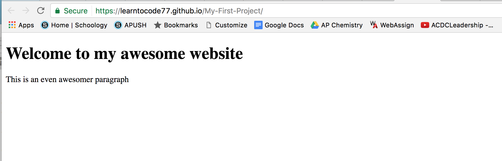

## Build a website with Github Pages (no experience required)

Ever wanted to learn how to quickly build a website you can view from anywhere in the world?  Follow this tutorial and you'll be well on your way to creating your own websites in HTML.  

What is Github? 
 GitHub is an online storage space of coding projects.  It lets you and others work together on projects from anywhere.  Think of it like Google Docs, with a Github repository being equivalent to a folder in Google Docs, and individual files as files in Github.  They also share the feature of collaboration. 
 
 What is Github Pages?
 
 GitHub Pages is designed to host your personal, organization, or project pages directly from a GitHub repository. This means that you can easily create websites for free by uploading files into your Github account. 
 
 What is HTML? 
 
 HTML stands for Hypertext Markup Language, which is a scripting language that tells a hosting service (in this case Github Pages) what fonts, colors, and graphics your website will include. 
 
 In this tutorial, we'll be learning how to use Github Pages and HTML to create a basic website.
 
 ## Step 1: Create a Github account


<br />
<br />

<br />
<br />


Later you may want to keep your code private, but for learning purposes, having unlimited public repositories will work fine. 


<br />
<br />


Next, click "Start a Project"


<br />
<br />


When creating our new repository, make sure "initialize this repository with a README.md" is checked.  This will save us some time in setting up. 


<br />
<br />


Congrats!  You have created your first Github repository.  

Below is the main page for the code in your new repository.  Click "Create new file" to create the main page of your website.


<br />
<br />


Name this file "index.html".  Github Pages recognized "index.html" as the file to display when the link to your website is clicked.  The ".html" extension indicates the coding language the file is written in, HTML. 


The code below sets up a basic HTML webpage.
<br />
<br />


```markdown
The <!DOCTYPE html> declaration defines this document to be HTML5
The <html> element defines the page as an HTML document.
The <head> element contains head elements, including a title for the website.
The <title> element specifies a title for the document
The <body> element contains the visible page content.  This can include paragraphs and headers.
```


Next, enter a commit message and click "Commit new file" to save your changes to the file.


<br />
<br />


As seen below, your new file has been created.  Next, click "Settings" to setup Github Pages. 


<br />
<br />


<br />
<br />

Next, scroll down to the "Github Pages" section to setup your website. 


<br />
<br />

Click the link below to visit your new website. You'll notice that your new website is blank.  We can easily fix this by including a few elements in the "body" section of our "index.html"


<br />

<br />
Include a few elements, as seen below.


<br />
<br />
Don't forget to commit your changes! 


Hooray!  You have now set up your first website!
<br />
<br />



Next, we'll be talking about uploading images to your website.  Be sure to prepare your favorite pictures to display. 

See you next time :)
<br />

Check out more repositories at github.com/zsheill7

<!--### Markdown

Markdown is a lightweight and easy-to-use syntax for styling your writing. It includes conventions for

```markdown
Syntax highlighted code block

# Header 1
## Header 2
### Header 3

- Bulleted
- List

1. Numbered
2. List

**Bold** and _Italic_ and `Code` text

[Link](url) and 
```

For more details see [GitHub Flavored Markdown](https://guides.github.com/features/mastering-markdown/).

### Jekyll Themes

Your Pages site will use the layout and styles from the Jekyll theme you have selected in your [repository settings](https://github.com/zsheill7/SwiftTutorial/settings). The name of this theme is saved in the Jekyll `_config.yml` configuration file.

### Support or Contact

Having trouble with Pages? Check out our [documentation](https://help.github.com/categories/github-pages-basics/) or [contact support](https://github.com/contact) and we’ll help you sort it out.-->
